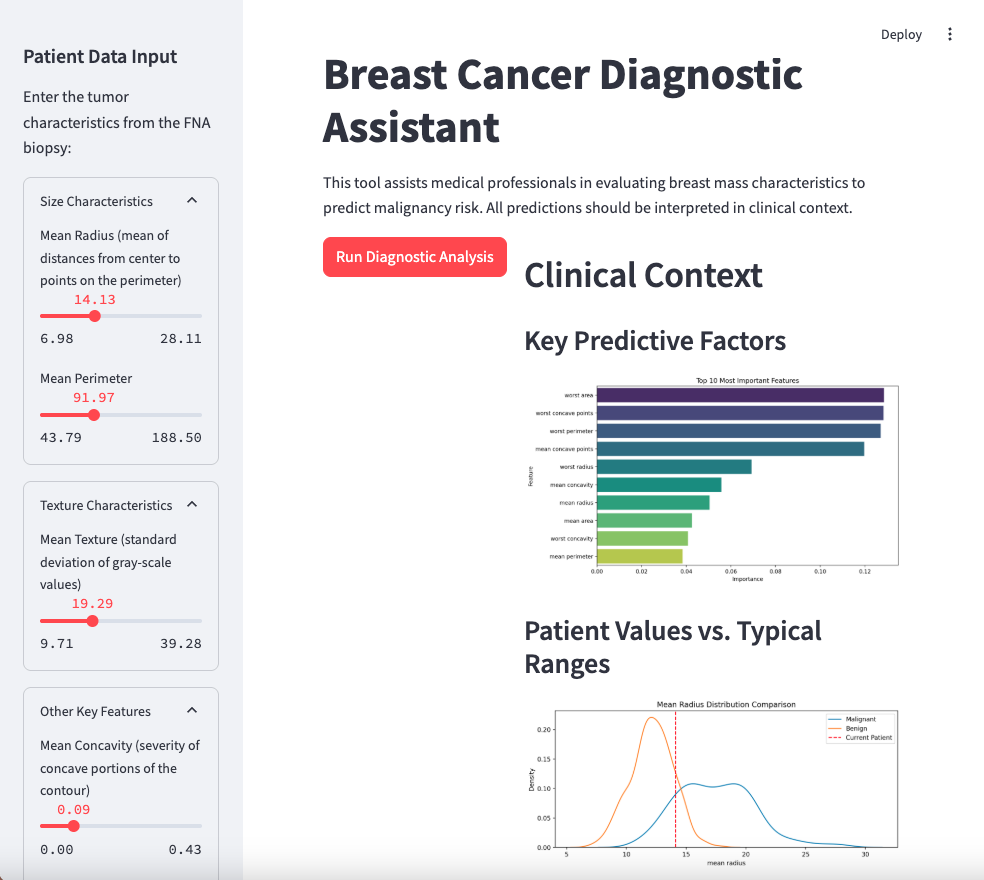

📌 Overview
A professional web application for predicting breast cancer malignancy based on tumor characteristics, designed for clinical use by medical professionals.

✨ Features
Clinical-Grade Interface: Designed for medical professionals with proper terminology

Interactive Inputs: Sliders for tumor characteristics with clinical ranges

### 1. 🖥️ Pantalla Principal

  

Visual Analytics:

Probability distributions

Feature importance plots

Comparative analysis

Robust Prediction Engine:

Handles all 30 diagnostic features

Confidence scoring

Clinical recommendations

🛠️ Technical Stack
Component	Technology
Frontend	Streamlit
Machine Learning	Scikit-learn
Visualization	Matplotlib, Seaborn
Data Handling	Pandas, NumPy
🚀 Installation
Clone the repository:

bash
git clone https://github.com/RosanaNicklas/breast-cancer-diagnostic
cd breast-cancer-diagnostic
Create and activate virtual environment:

bash
python -m venv venv
source venv/bin/activate  # Linux/Mac
venv\Scripts\activate  # Windows
Install dependencies:

bash
pip install -r requirements.txt
🏃‍♂️ Running the App
bash
streamlit run app.py
The app will launch at http://localhost:8501

🧪 Model Details
Algorithm: Random Forest Classifier

Accuracy: 96.5% (test set)

Features: 30 tumor characteristics including:

Mean radius

Mean texture

Mean perimeter

Mean concavity

Worst smoothness

etc.

📊 Data Source
Wisconsin Breast Cancer Diagnostic Dataset from scikit-learn:

569 samples (212 malignant, 357 benign)

30 numeric features

  

📝 Clinical Disclaimer
Important: This tool provides statistical predictions only. It is not a substitute for professional medical diagnosis. Always consult with a qualified healthcare provider for medical decisions.

🤝 Contributing
Fork the repository

Create your feature branch (git checkout -b feature/AmazingFeature)

Commit your changes (git commit -m 'Add some AmazingFeature')

Push to the branch (git push origin feature/AmazingFeature)

Open a Pull Request

📜 License
Distributed under the MIT License. See LICENSE for more information.

📧 Contact

Rosana Longares - rosana8longares@gmail.com

