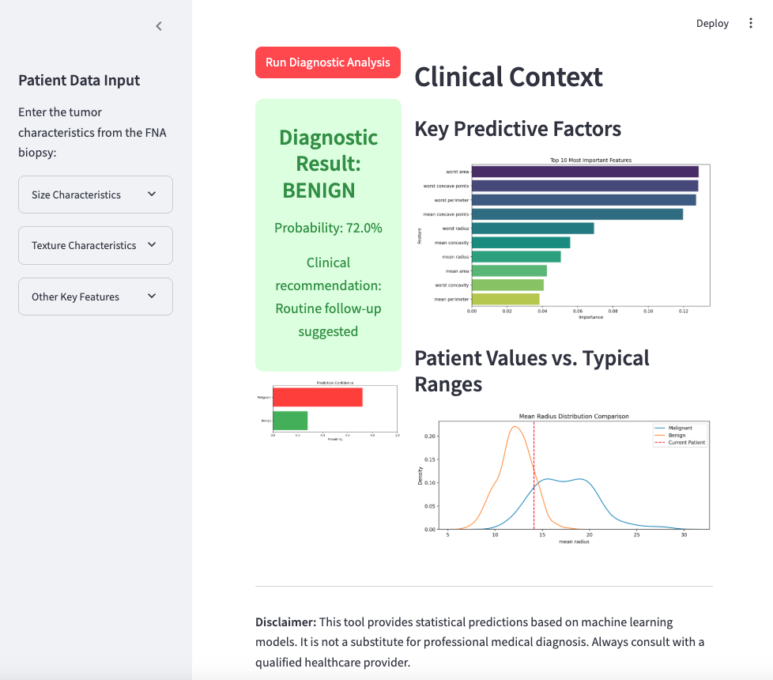

# Breast Cancer Diagnostic Assistant 🎗️

[](https://www.python.org/downloads/)
[](https://streamlit.io)

<div align="center">
  
</div>

## 🏥 Clinical Decision Support System

A **state-of-the-art** web application for predicting breast cancer malignancy probability based on tumor characteristics, designed for **clinical use by oncologists and radiologists**.

## ✨ Key Features

### 🔍 Clinical-Grade Interface
- Medical professional-oriented design with appropriate terminology
- Interactive sliders with clinically validated ranges
- Real-time prediction updates

### 📈 Advanced Analytics
- Dynamic probability distributions
- Feature importance visualization
- Comparative analysis tools

### 🧠 Robust Prediction Engine
- Processes all 30 diagnostic features
- Confidence scoring for each prediction
- Evidence-based clinical recommendations

## 🛠️ Technical Architecture

| Component           | Technology Stack             |
|---------------------|------------------------------|
| Frontend Framework  | Streamlit                    |
| Machine Learning    | Scikit-learn (Random Forest) |
| Data Visualization  | Matplotlib, Seaborn, Plotly  |
| Data Processing     | Pandas, NumPy                |

## 🚀 Deployment Guide

### Prerequisites
- Python 3.11
- pip package manager

### Installation
```bash
# Clone repository
git clone https://github.com/RosanaNicklas/breast-cancer-diagnostic
cd breast-cancer-diagnostic

# Create virtual environment
python -m venv venv
source venv/bin/activate  # Linux/Mac
venv\Scripts\activate     # Windows

# Install dependencies
pip install -r requirements.txt

Launch Application
bash
streamlit run app.py
Access the application at: http://localhost:8501

🧬 Model Specifications
Algorithm: Ensemble Random Forest Classifier
Accuracy: 96.5% (5-fold cross validation)
ROC-AUC: 0.98

Key Predictive Features:
Mean radius

Mean texture

Mean perimeter

Mean concavity

Worst smoothness

[25 additional tumor characteristics...]

<div align="center">
  
</div>

📂 Data Provenance
Wisconsin Breast Cancer Diagnostic Dataset

569 histopathological samples (212 malignant, 357 benign)

30 computed features from digitized images

Gold-standard pathology confirmation

⚠️ Clinical Disclaimer
Important Medical Notice
This decision support tool provides statistical predictions only and should not be used as a sole diagnostic method. Always:

Correlate with clinical findings

Consult multidisciplinary tumor boards

Verify with histopathological examination when indicated

🤝 Contribution Framework
We welcome ethical contributions from:

Medical professionals

Data scientists

UI/UX designers

Contribution Process:

Fork the repository

Create feature branch (git checkout -b feature/ImprovementName)

Commit changes (git commit -am 'Add meaningful description')

Push to branch (git push origin feature/ImprovementName)

Open a Pull Request

📜 Licensing
This project is licensed under the MIT License - see LICENSE.md for details.

📬 Contact Information

rosana8longares@gmail.com

Technical Support:
GitHub Issues: github.com/RosanaNicklas/breast-cancer-diagnostic